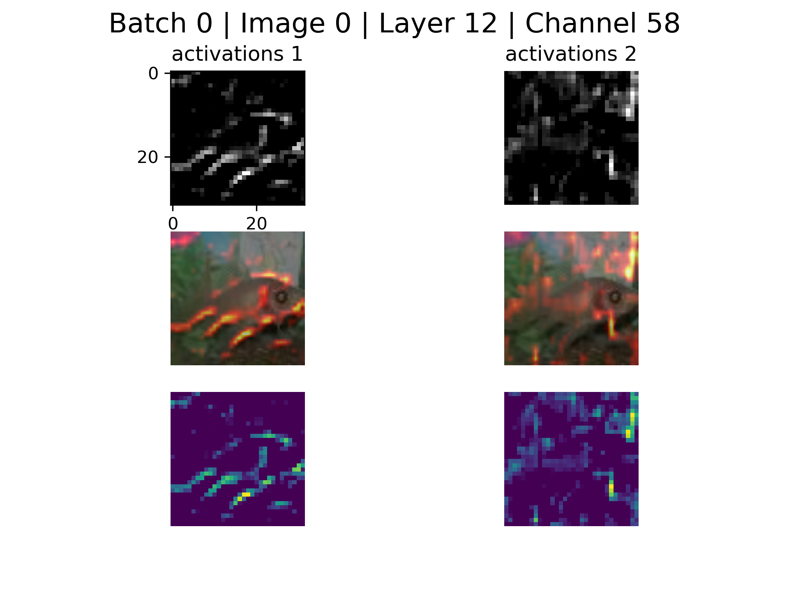

# Visualizing Activations in Semantic Segmentation Networks
**Connor Cook, Matt Hanley, Basu Parmar, Galen Pogoncheff, Scott Young**

[](https://travis-ci.com/matthewdhanley/csci5922)

#### Contents
- [Project Overview](#overview)
- [Comparison Methods](#analysis)
  * [Visualizing Activations](#activ)
  * [Visualizing Maximally Activating Images](#max_activ)
- [Summary of Results](#results)
- [Getting Started](#start)
- [Setup](#setup)
  * [Dependencies](#dependencies)
  * [Project Datasets](#data)
- [Training](#training)
- [Visualizing Activations](#activations)
  * [Save Activations](#activations_save)
  * [Channel Matching](#channel_match)
  * [View Activations](#activations_view)
- [Visualizing Convolutional Channels](#channel_vis)
- [References](#references)

<a name="overview"></a>
## Project Overview
Neural networks are notoriously known for being difficult to interpret. The visualization techniques proposed by [Zeiler and Fergus (2013)](https://arxiv.org/abs/1311.2901) for visualizing the activity within convolutional networks gave rise to a deeper understanding of what is being learned by convolutional networks, enabling a more methodical model development process. Despite the success of these visualization techniques on convolutional networks designed for image classification, similar approaches are not widely used in networks constructed for semantic segmentation.<br>

This project aims to address this problem by comparing visualizations from networks trained for image classification and networks trained for semantic segmentation.  These comparisions were then used to conclude whether the task of semantic segmentaion leads the encoder portion of the network to learn inherently different features than it would if the network to be trained for image classification.<br>

The two networks that we used for this analysis were a VGG-11 classification network pretrained on the imagenet dataset and an implementation of [TernausNet](https://arxiv.org/abs/1801.05746), a U-Net which features a VGG-11 encoder.  We trained the U-Net on the [Cityscapes](https://www.cityscapes-dataset.com) semantic segmentation dataset.

<a name="analysis"></a>
## Comparison Methods
Two visualization methods were used to qualitatively analyze the differences in the encoder layers of the classification and semantic segmentation networks - visualizing the activations of each layer after forwarding an image throught the network and artificially reconstructing an image that maximally activates an output channel of a convolutional layer.

<a name="activ"></a>
### Visualizing Activations
Activation visualizations were generated by forwarding an image (sourced from the Cityscapes or Tiny ImageNet dataset) through each network, saving the activations values from every channel of each layer of the network, and then projecting these activations into the input pixel space.  In order to aid in the visualization of these results, image heatmaps were created by highlighting the activated regions of the original image.  Provided below are two sample visualizations.

***Figure 1**: Activations from Layer 1 Channel 5.  Left Column: VGG-11 Channel Activations (top), heatmap of activations over cityscapes input image (middle), difference between VGG-11 channel activations and associated U-Net channel activations (bottom). Right Column: U-Net Channel Activations (top), heatmap of activations over cityscapes input image (middle), difference between U-Net channel activations and associated VGG-11 channel activations (bottom)*

<p align="center">
 
</p>

***Figure 2**: Activations from Layer 12 Channel 58.  Left Column: VGG-11 Channel Activations (top), heatmap of activations over Tiny ImageNet input image (middle), difference between VGG-11 channel activations and associated U-Net channel activations (bottom). Right Column: U-Net Channel Activations (top), heatmap of activations over Tiny ImageNet input image (middle), difference between U-Net channel activations and associated VGG-11 channel activations (bottom)*

<p align="center">
 
</p>

<a name="max_activ"></a>
### Visualizing Maximally Activating Images
Another method for visualizing the mechanics of a convolutional network is to construct an image that maximally activates an output channel of a given convolutional encoding layer.  A parallel idea has been previously explored in the works of [DeepDream](https://ai.googleblog.com/2015/06/inceptionism-going-deeper-into-neural.html).  The resulting constructed input image allowed us to view the patterns and textures that the network is seeking to find in a given layer’s output channel.

The process of solving for this maximally activating image involved starting with an image with randomized RGB pixel values and then iteratively upscaling and optimizing the pixel values of this image.  In each iteration of this process, we first update the pixel values of the input image for a set number of steps.  This optimization process entails maximizing the mean activation of the selected output channel of the convolutional layer.  We therefore define a loss function as the negation of the mean value of the output feature map.  We minimize this loss function by propagating the loss backwards to the input image (while keeping the network parameters fixed), enabling us to progressively construct an input image that maximizes this feature map.  Following this optimization step, we upscale the image size before proceeding to the subsequent iteration.  After performing multiple iterations, the resulting input image closely approximates the image that maximizes the feature map in question.

Provided below are sample visualiations that accomplish this task.

***Figure 3**: Images that maximally activate 9 different channels of convolutional layer 2 of the VGG-11 classification encoder*
<p align="center">
 
</p>

***Figure 4**: Images that maximally activate 9 different channels of convolutional layer 2 of the U-Net semantic segmentation encoder*
<p align="center">
 
</p>

***Figure 5**: Images that maximally activate 9 different channels of convolutional layer 7 of the VGG-11 classification encoder*
<p align="center">
 
</p>

***Figure 6**: Images that maximally activate 9 different channels of convolutional layer 7 of the U-Net semantic segmentation encoder*
<p align="center">
 
</p>

<a name="results"></a>
## Summary of Results

<a name="start"></a>
## Getting Started
Usage can be obtained by running
```
python main.py --help
```

1. It is suggested that dependencies are installed in a virtual environment for this project. Installing requirements can
be done as described in [Dependencies](#dependencies).
2. Download the Cityscapes dataset from the link in the [Data](#data) section. Once it is downloaded, ensure that the
structure matches that defined in [Cityscapes dataset directory structure](#cs-structure).
3. Train the in situ UNet model and pretrained VGG-11 encoder UNet model as described in the [Training](#training) section.
4. Get activations from the trained networks as specified in [Save Activations](#save-activations).
5. Match channels of the activations as described in [Channel Matching](#channel-matching).

*Note:* when running the above training or activation saving, the keyword `--subset` can be used to use a small subset
of cityscape images. Without sufficient resources, these tasks can be very slow (or even impossible). The keyword
`--no_resize` can be used to not scale down the images, however this would result in a very computationally expensive
process. It is not feasible to do this with the entire dataset unless you have a lot of RAM.

Now you are setup to perform a number of tasks:
* Visualize activations of channels as described in [View Activations](#view-activations).
* View maximally activated input images as described in [Visualizing Maximally Activating Images](#max_activ)
* Check performance of model as described in [Validating models and measuring performance](#validation)

<a name="dependencies"></a>
### Dependencies
This source code for this project was written in Python 3.  The following command will install the required project dependencies. Unit
testing is performed for Python versions 3.5 and 3.6.
```
pip install -r requirements.txt
```

<a name="data"></a>
### Project Datasets
We used the [Cityscapes](https://www.cityscapes-dataset.com/downloads/) dataset for semantic segmentaion (fine 
annotations) to train our U-Net model.  The dataset is comprised of 3475 labeled training and validation images, combined,
and 1525 test images. It is possible to also get an additional 19,998 coarsely annotated images, but we were limited by
computational resources to process this much data.

Network activation visualizations were obtained using images from Cityscapes dataset and the 
[Tiny ImageNet](https://tiny-imagenet.herokuapp.com/) dataset.

<a name="cs-structure"></a>
#### Cityscapes dataset directory structure
Shown below is the Cityscape data hierarchy expectedby our training script.  Within each of the test, train, and val 
folders are folders named after the city that the data was taken. These folders hold the respective data.
```
.
├── gtFine
│   ├── test
│   ├── train
│   └── val
└── leftImg8bit
    ├── test
    ├── train
    └── val
```

<a name="training"></a>
## Training
In situ model training:
```
python main.py cityscapes_path/ --mode train --save_dir checkpoints/ --file unet.tar
```

Training with pretrained VGG-11 encoder:
```
python main.py cityscapes_path/ --mode train --save_dir checkpoints/ --file unet.tar --pretrained
```
This latter configuration loads the weights for the VGG-11 encoder that was trained on ImageNet then freezes those layers
as it trains.

When training, the user has the option to change some hyperparameters from the command line interface. Options that can
be changed include batch size `--batch_size` (default 8), learning rate `--learning_rate` (default 0.001), or number of epochs `--epochs` (default 100).
The analysis done here used all the default parameters.

<a name="activations"></a>
## Visualizing Activations

<a name="activations_save"></a>
#### Save Activations
```
python main.py path/to/dataset --mode activations --model unet --checkpoint unet.tar
```
This will create a directory from the root of the project called `activations/` and will create a UNet activations file if
run with `--model unet` and a VGGmod activations file if run with argument `--model vggmod`. In order to run channel
matching, both models must be run. This can be in one fell swoop done with `--model both`.

<a name="channel_match"></a>
#### Channel Matching
```
python main.py path/to/activations --mode compare_activations --type normal
```
This will try to best match the channels based on their activations. This will output a file called UNet_activations_matched 
which is essentially a rearranged version of the activations file created by `--mode activations`. `--type` specifies 
how the channel matching is performed. Values can be 'normal', 'blur', 'dilation', or 'pooling'.

<a name="activations_view"></a>
#### View Activations
```
python main.py path/to/activations --mode view_activations
```
This will create a folder called `activation_visualizations` and will place photos showing activations for both VGG-11
and UNet. Can use parameters `--start_layer` and `--stop_layer` to specify which layer to start and stop with visualizations.

Viewing activations provides a grid of size 3x2 images. The left column images are derived from the VGG-11 classifier. 
The right column of images are derived from the in situ UNet. The first row is the activation of the channel visualized
as a grayscale image. The second row shows the activations as a heat map overlaid on the original image. This allows us
to see what features the filter is looking for in that specific channel and layer. The final row shows the difference
between the VGG-11 activations and in situ UNet activations. The left will be VGG-11 minus UNet, clipping values below
zero. The right is the opposite, also clipping values less than zero.

<a name="channel_vis"></a>
## Visualizing Convolutional Channels
```
python main.py path --mode ... #TODO!!!!!!!!!!!!!!!!!!!!!!!!!!!!!!
```

<a name="validation"></a>
## Validating models and measuring performance
```
python main.py path/to/dataset --mode test --checkpoint model.tar
```

<a name="references"></a>
## References
TODO
